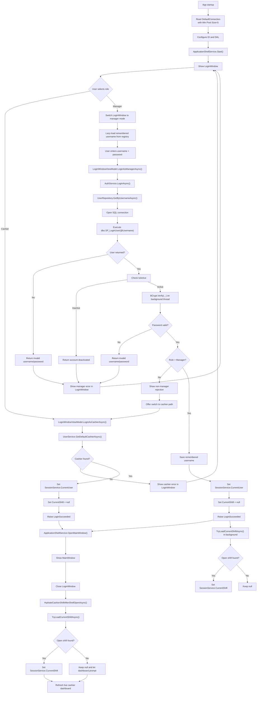

# Login Process Flowchart

Current-state login flow for the POS app after the August 17, 2026 login refactor.

## Summary

- Startup opens a single `LoginWindow`.
- Cashier login uses the default cashier lookup path.
- Manager login uses `SP_LoginUser` through raw ADO, then BCrypt verification.
- Successful shell-open happens before shift hydration finishes.
- `Session` table inserts are no longer part of the login critical path.

## Flowchart

## Notes

- `SP_LoginUser` returns the user record plus role name in one round trip.
- `BCrypt.Verify` still remains part of the manager critical path.
- `Min Pool Size=5` helps avoid paying full connection setup cost on the first few logins after process start.
- Logout returns the app to the same `LoginWindow` flow.
